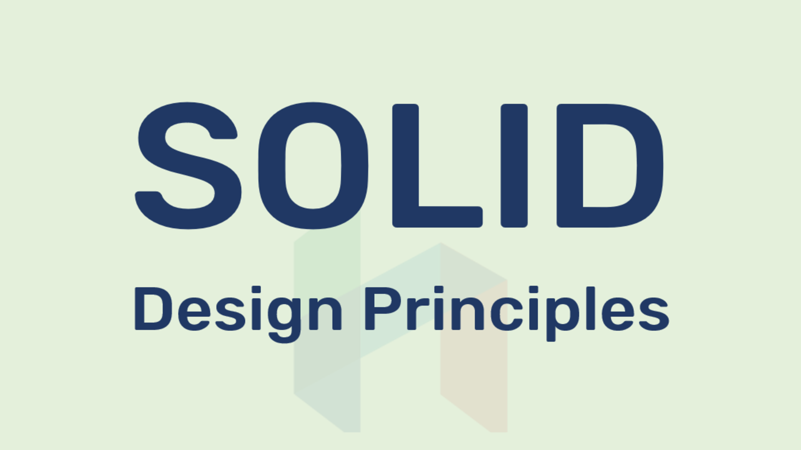

# SOLID Prinsiplərinə Aid Nümunələr (PHP)

**SOLID prinsipləri**; İnkişaf etdirilən proqramın təkrar istifadə edilə bilən, davamlı və başa düşülən olmasını təmin edən, kod təkrarlanmasının qarşısını alan Robert C. Martin tərəfindən irəli sürülən prinsiplər toplusudur.
 
Qısaltması Michael Feathers tərəfindən müəyyən edilən bu prinsipin məqsədi;

- Hazırladığımız proqramın asanlıqla gələcək tələblərə uyğunlaşdırılması,
- Kodu dəyişdirməyə ehtiyac olmadan asanlıqla yeni xüsusiyyətlər əlavə edə bilməyimiz
- Yeni tələblərə baxmayaraq kodda minimum dəyişiklik,
- Koddakı davamlı düzəliş və ya hətta yenidən yazma kimi problemlərin yaratdığı zaman itkisini minimuma endirməkdir.

> Bu prinsipləri tətbiq etməklə proqramlarımızın böyüməsinin və mürəkkəbliyin artmasının qarşısını alırıq."Yaxşı kod" yazmaq üçün bu prinsiplərə uyğun bir proqram hazırlamalıyıq.

## 1 - Single Responsibility Principle (SRP) ([Nümunə](./1%20-%20SRP/Doğru.php))

**Xülasə:** Sinif (obyekt) yalnız bir məqsəd üçün dəyişdirilə bilər ki, bu da həmin sinifə qoyulmuş məsuliyyətdir, buna görədə bir sinifin (class) yalnız bir öhdəliyi olmalıdır.

## 2 - Open Closed Principle (OCP) ([Nümunə](./2%20-%20OCP/Doğru.php))

**Xülasə:** Bir sinif və ya funksiya (method) mövcud xüsusiyyətləri qorumalı və dəyişikliklərə icazə verməməlidir. Başqa sözlə, davranışını dəyişdirməməli və yeni xüsusiyyətlər qazanmağı bacarmalıdır.

## 3 - Liskov Substitution Principle (LSP) ([Nümunə](./3%20-%20LSP/Doğru.php))

**Xülasə:** Kodumuzda hər hansı bir dəyişiklik etməyə ehtiyac olmadan, əldə etdikləri (yuxarı) siniflər əvəzinə alt siniflərdən istifadə edə bilməliyik.

## 4 - Interface Segregation Principle (ISP) ([Nümunə](./4%20-%20ISP/Doğru.php))

**Xülasə:** Bütün məsuliyyətləri vahid bir interfeysdə toplamaq əvəzinə daha çox xüsusi interfeyslər yaratmalıyıq.

## 5 - Dependency Inversion Principle (DIP) ([Nümunə](./5%20-%20DIP/Doğru.php))

**Xülasə:** Siniflər (class) arasındakı asılılıqlar mümkün ola biləcəyi qədər az olmalıdır, xüsusilə yuxarı siniflər aşağı siniflərdən asılı olmamalıdır.

### Author: [Seymur Umudov](https://github.com/useymur)
